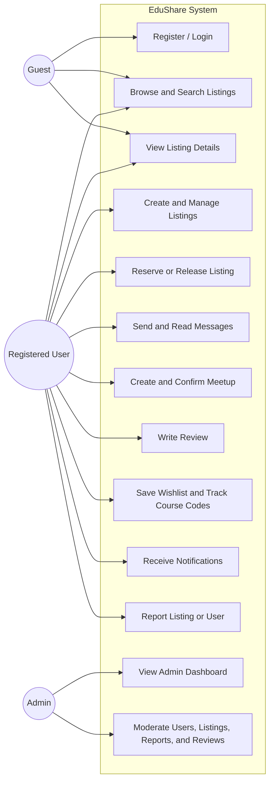
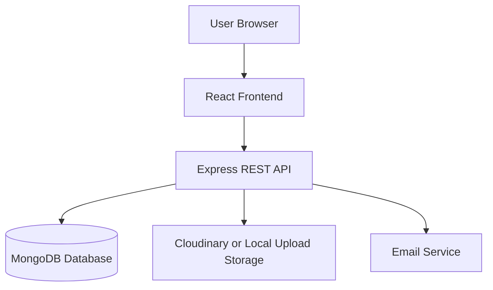
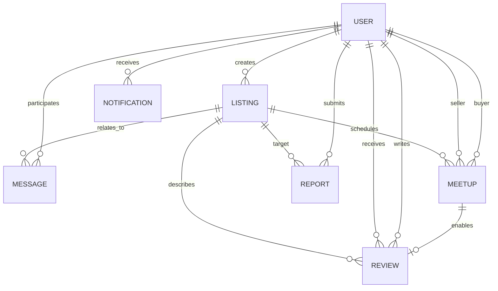

# FINAL PROJECT REPORT SOURCE

Replace all bracketed placeholders before exporting this document to PDF.

## Cover Page

MINISTRY OF EDUCATION & TRAINING  
HO CHI MINH CITY UNIVERSITY OF TECHNOLOGY (HUTECH)  

**FINAL PROJECT REPORT**  
**[CAP126] - NEW PROGRAMMING LANGUAGE**  

**Project Title:**  
**EduShare: A Smart Web-Based Marketplace for University Students to Exchange Textbooks and Learning Materials**  

**Lecturer's name:** Hannah Vu  
**Student's name:** Mai Tan Phat  
**Student ID:** 2280602300  
**Class:** 22DTHQA2  
**Group:** Group 6  

Ho Chi Minh City, 2026

---

## Table of Contents

1. Introduction ................................................................ 3  
1.1 Reason for Choosing the Topic ................................... 3  
1.2 Project Objectives .................................................... 4  
1.3 Scope of the Project .................................................. 4  
2. System Overview .......................................................... 5  
2.1 Description of the System ........................................ 5  
2.2 Main Features ............................................................ 5  
2.3 Target Users .............................................................. 6  
2.4 Use Case Diagram .................................................... 6  
2.5 Explanation of User Interactions ............................. 7  
3. System Design ............................................................. 8  
3.1 System Architecture ................................................. 8  
3.2 Database Design ....................................................... 9  
3.3 Collection Relationships ........................................ 13  
3.4 ER Diagram .............................................................. 13  
3.5 API Design ............................................................... 14  
4. Implementation ............................................................ 15  
4.1 Technologies Used and Reasons for Choosing Them ... 15  
4.2 System Structure ...................................................... 16  
4.3 Description of Main Functions ................................ 16  
4.4 Screenshots to Include in the Final PDF ............... 18  
5. Testing ....................................................................... 18  
5.1 Testing Approach ..................................................... 18  
5.2 Executed Test Cases ............................................... 18  
5.3 Test Results ............................................................. 19  
6. Deployment ................................................................. 19  
6.1 How to Run the Project Locally ............................... 19  
6.2 Source Code Repository ......................................... 20  
6.3 Demo Link ............................................................... 20  
7. Conclusion .................................................................. 20  
8. References ................................................................. 20  
9. Team Contribution ...................................................... 20

---

## 1. Introduction

### 1.1 Reason for Choosing the Topic

We chose this topic because buying and selling used study materials is a common need among university students. In many classes, students need textbooks, printed notes, lab kits, calculators, or reference books for only one semester. After the course ends, these materials are often no longer needed, while other students still need them for the next term. In practice, many students try to exchange these items through Facebook groups, chat messages, or informal posts in class groups. However, those methods are not organized, difficult to search, and not always safe.

Another reason for choosing this topic is that it is close to real student life. Compared with a general online shopping website, a campus marketplace has different requirements. Students usually want low prices, fast communication, and convenient meetup locations inside the campus. They also need some level of trust because they often buy from other students they do not know personally. Because of that, this topic gave us a good chance to build not only basic CRUD functions, but also practical features such as recommendation, smart price suggestion, trust indicators, and safer meetup planning.

From a technical point of view, this project is suitable for a final assignment in a web programming course. It combines frontend development, backend API design, database design, authentication, file upload, role management, and testing. It also allowed us to go beyond a simple marketplace demo and build a system that solves a realistic problem in a university environment.

### 1.2 Project Objectives

The main objectives of this project are:

- To build a web-based marketplace where students can buy, sell, lend, or give away study materials.
- To support user registration, login, and account management in a secure way.
- To allow users to create, edit, search, reserve, and manage listings.
- To provide messaging and meetup planning so buyers and sellers can coordinate the exchange process.
- To add trust and safety functions such as user reviews, seller trust indicators, reporting, and moderation.
- To improve the user experience with recommendation logic, smart pricing support, wishlist tracking, and notifications.
- To design the system using a clear client-server structure with React, Node.js, Express, and MongoDB.

### 1.3 Scope of the Project

The project focuses on a university learning-material marketplace. The system is designed mainly for students who want to exchange textbooks and related academic items inside or around the campus area.

The current scope includes:

- Guest browsing and public search
- User authentication and profile management
- Listing creation and management
- Search, filter, and sort functions
- Reservation workflow
- Direct messaging between users
- Campus meetup planning
- Review and trust scoring
- Wishlist and notification support
- Admin moderation for users, listings, reports, and reviews

The project does not currently include:

- Online payment integration
- Delivery or shipping management
- Real-time chat with WebSocket
- Native mobile application
- Multi-university deployment

These items can be considered for future development.

---

## 2. System Overview

### 2.1 Description of the System

EduShare is a student marketplace web application for exchanging textbooks and learning materials. The system allows users to publish listings, browse available items, search with filters, contact sellers, arrange meetups, and leave reviews after successful transactions. The application also includes several supporting features that make it more useful than a basic CRUD website, such as recommendations, price suggestions, trust badges, notifications, and an admin moderation dashboard.

At a high level, the system works as follows. A guest user can browse the homepage and search listings. If the user wants to create a listing or reserve an item, the user must register and log in. After authentication, the user can manage listings, save favorite items, track course codes, send messages, and create meetups. When a transaction is completed, the buyer can leave a review. An admin user can open the moderation dashboard to monitor reports, hide problematic listings, moderate reviews, or ban accounts that violate the platform rules.

### 2.2 Main Features

| Feature | Short Description | Purpose |
| --- | --- | --- |
| Authentication | Register, login, forgot password, reset password, current-user session bootstrap | Protect user data and support secure access to private functions |
| Listing CRUD | Create, read, update, and delete listings with images and item details | Allow students to publish and manage study material offers |
| Search and Filtering | Search by text and filter by category, condition, price, location, and sorting | Help users find suitable listings quickly |
| Reservation Workflow | Reserve and release listings with controlled status transitions | Prevent multiple buyers from taking the same item at the same time |
| Messaging | Listing-based conversations between buyer and seller | Support communication inside the platform |
| Meetup Planner | Suggested campus-safe meetup locations and confirmation states | Make item exchange more convenient and safer |
| Reviews and Trust | Ratings, reviews, badges, trust score, transaction count | Increase confidence when users interact with each other |
| Wishlist and Alerts | Save listings and track course codes | Help users follow items they care about |
| Notifications | Alerts for messages, reservation events, meetup updates, reviews, and wishlist matches | Keep users informed about important actions |
| Recommendation Engine | Home and related listing recommendations based on relevance and behavior | Improve discovery of useful items |
| Smart Price Suggestion | Suggested price range from similar listings and item condition | Help sellers set more realistic prices |
| Admin Moderation | Role updates, ban or unban users, hide or unhide listings, resolve reports, moderate reviews | Maintain platform quality and reduce abuse |

### 2.3 Target Users

The system has three main user roles.

| User Role | Description | Main Abilities |
| --- | --- | --- |
| Guest | A visitor who has not logged in yet | Browse homepage, search listings, view listing details, open authentication page |
| Registered User | A normal student account | Create and manage listings, reserve items, send messages, plan meetups, save items, receive notifications, write reviews, report problems |
| Admin | A user with moderation permission | View admin overview, change user role, ban or unban users, hide or unhide listings, resolve reports, moderate reviews |

### 2.4 Use Case Diagram

The following diagram summarizes the main interactions between actors and the system.



| Actor | Main Interactions |
| --- | --- |
| Guest | Register or login, browse listings, search the marketplace, view listing details |
| Registered User | Browse listings, manage personal listings, reserve items, message sellers, create meetups, write reviews, save wishlist items, receive notifications, submit reports |
| Admin | View the admin dashboard, manage reports, moderate users, moderate listings, and moderate reviews |

### 2.5 Explanation of User Interactions

Guests mainly interact with the public parts of the system. They can explore listings and understand what the application offers, but they cannot perform protected actions.

Registered users are the core users of the platform. They create listings, communicate with other students, reserve items, track meetups, and leave reviews. The system also gives them personalized functions such as saved items, tracked course codes, and notification updates.

Admins use the moderation functions of the platform. Their role is not related to buying or selling only. They maintain the safety and reliability of the system by handling reports, hiding inappropriate content, and controlling account status.

---

## 3. System Design

### 3.1 System Architecture

EduShare follows a client-server architecture. The frontend is built with React and communicates with the backend through RESTful APIs. The backend is built with Node.js and Express. MongoDB is used to store application data, while Mongoose is used to define schemas and database relationships. JWT is used for authentication, and uploaded images can be stored through Cloudinary or local upload paths. The backend also supports email-related actions for password recovery and account verification.

The structure is close to an MVC-style organization. Routes receive HTTP requests, controllers handle request logic, services contain reusable business rules, and models define the MongoDB collections.



### 3.2 Database Design

The system uses MongoDB collections instead of relational tables. The most important collections are `User`, `Listing`, `Message`, `Meetup`, `Review`, `Report`, and `Notification`.

#### 3.2.1 User Collection

Primary key: `_id`

| Field | Data Type | Description |
| --- | --- | --- |
| _id | ObjectId | Unique identifier of the user |
| name | String | Full name of the user |
| email | String | Unique email address |
| username | String | Optional username |
| password | String | Hashed password |
| major | String | User major or field of study |
| role | String | `user` or `admin` |
| status | String | `Active` or `Banned` |
| rating | Number | Overall rating value |
| totalRatings | Number | Number of ratings received |
| emailVerified | Boolean | Email verification state |
| savedListings | ObjectId[] | Saved listing references |
| trackedCourseCodes | String[] | Followed course codes |
| preferredMeetupLocations | String[] | User-preferred meetup places |
| createdAt / updatedAt | Date | Timestamp fields |

#### 3.2.2 Listing Collection

Primary key: `_id`  
Foreign key: `seller -> User._id`

| Field | Data Type | Description |
| --- | --- | --- |
| _id | ObjectId | Unique identifier of the listing |
| title | String | Listing title |
| description | String | Listing description |
| courseCode | String | Related course code |
| category | String | `Textbooks`, `Lab Kits`, `Notes`, or `Others` |
| condition | String | `New`, `Good`, `Fair`, or `Poor` |
| price | Number | Current listing price |
| priceHistory | Array | Past price values and timestamps |
| images | String[] | Image URLs or file paths |
| seller | ObjectId | Seller reference |
| visibility | String | `Visible` or `Hidden` |
| status | String | `Active`, `Reserved`, or `Sold` |
| reservedBy | ObjectId | Buyer who reserved the item |
| edition | String | Book edition |
| isbn | String | ISBN field if available |
| views | Number | Number of listing views |
| campusLocation | Object | Preferred meetup location data |
| reportCount | Number | Number of reports related to the listing |
| createdAt / updatedAt | Date | Timestamp fields |

#### 3.2.3 Message Collection

Primary key: `_id`  
Foreign keys: `listing -> Listing._id`, `participant1 -> User._id`, `participant2 -> User._id`

| Field | Data Type | Description |
| --- | --- | --- |
| _id | ObjectId | Unique identifier of the conversation |
| listing | ObjectId | Listing reference for contextual chat |
| participant1 | ObjectId | First participant |
| participant2 | ObjectId | Second participant |
| messages | Array | Embedded message items |
| messages.senderId | ObjectId | Sender reference |
| messages.text | String | Message content |
| messages.timestamp | Date | Time of the message |
| messages.isRead | Boolean | Read state |
| lastMessage | Date | Latest activity time |
| createdAt / updatedAt | Date | Timestamp fields |

#### 3.2.4 Meetup Collection

Primary key: `_id`  
Foreign keys: `listing -> Listing._id`, `buyer -> User._id`, `seller -> User._id`

| Field | Data Type | Description |
| --- | --- | --- |
| _id | ObjectId | Unique identifier of the meetup |
| listing | ObjectId | Listing related to the meetup |
| buyer | ObjectId | Buyer reference |
| seller | ObjectId | Seller reference |
| location | String | Chosen meetup location |
| locationId | String | Location code if selected from campus list |
| date | Date | Meetup date |
| time | String | Meetup time in HH:mm format |
| status | String | `Pending`, `Confirmed`, `Completed`, or `Cancelled` |
| buyerConfirmed | Boolean | Buyer confirmation status |
| sellerConfirmed | Boolean | Seller confirmation status |
| confirmedAt | Date | Confirmation time |
| suggestedLocations | Array | Ranked suggested campus locations |
| completedAt | Date | Completion time |
| createdAt / updatedAt | Date | Timestamp fields |

#### 3.2.5 Review Collection

Primary key: `_id`  
Foreign keys: `listing -> Listing._id`, `reviewer -> User._id`, `reviewee -> User._id`, `meetup -> Meetup._id`

| Field | Data Type | Description |
| --- | --- | --- |
| _id | ObjectId | Unique identifier of the review |
| listing | ObjectId | Listing reference |
| reviewer | ObjectId | User who writes the review |
| reviewee | ObjectId | User who receives the review |
| rating | Number | Score from 1 to 5 |
| comment | String | Review content |
| status | String | `Published` or `Hidden` |
| moderationNote | String | Admin note if moderated |
| moderatedBy | ObjectId | Admin reference |
| moderatedAt | Date | Moderation time |
| meetup | ObjectId | Related meetup reference |
| createdAt / updatedAt | Date | Timestamp fields |

#### 3.2.6 Report Collection

Primary key: `_id`  
Foreign keys: `reporter -> User._id`, `targetListing -> Listing._id`, `targetUser -> User._id`, `resolvedBy -> User._id`

| Field | Data Type | Description |
| --- | --- | --- |
| _id | ObjectId | Unique identifier of the report |
| reporter | ObjectId | User who submits the report |
| targetType | String | `listing` or `user` |
| targetListing | ObjectId | Reported listing reference |
| targetUser | ObjectId | Reported user reference |
| reason | String | Main reason of the report |
| details | String | Additional explanation |
| status | String | `Open`, `Reviewed`, `Resolved`, or `Dismissed` |
| actionTaken | String | Moderation action result |
| resolutionNote | String | Admin resolution note |
| resolvedBy | ObjectId | Admin who handled the report |
| resolvedAt | Date | Resolution time |
| createdAt / updatedAt | Date | Timestamp fields |

#### 3.2.7 Notification Collection

Primary key: `_id`  
Foreign key: `user -> User._id`

| Field | Data Type | Description |
| --- | --- | --- |
| _id | ObjectId | Unique identifier of the notification |
| user | ObjectId | Receiver of the notification |
| type | String | Notification category |
| title | String | Short notification title |
| message | String | Notification message body |
| link | String | Frontend route related to the event |
| metadata | Mixed | Extra event data |
| priority | String | `low`, `normal`, or `high` |
| isRead | Boolean | Read state |
| readAt | Date | Time when marked as read |
| createdAt / updatedAt | Date | Timestamp fields |

### 3.3 Collection Relationships

The major relationships are:

- One user can create many listings.
- One listing belongs to one seller.
- One listing can have many messages, reports, and at most one active reservation state at a time.
- One meetup belongs to one listing, one buyer, and one seller.
- One completed meetup can lead to a review.
- One user can write many reviews and also receive many reviews.
- One user can submit many reports.
- One admin can resolve many reports and moderate many reviews.
- One user can receive many notifications.

### 3.4 ER Diagram



### 3.5 API Design

The backend exposes RESTful APIs. Some representative endpoints are shown below.

| Module | Method | Endpoint | Purpose | Request Example | Response Example |
| --- | --- | --- | --- | --- | --- |
| Auth | POST | `/api/auth/register` | Register a new account | name, email, password | user info + token |
| Auth | POST | `/api/auth/login` | Login with existing account | email, password | user info + token |
| Auth | POST | `/api/auth/forgot-password` | Send reset token | email | success message |
| Auth | POST | `/api/auth/reset-password/:token` | Reset password | newPassword | success message |
| Auth | GET | `/api/auth/me` | Get current user | JWT in header | user profile |
| Listings | GET | `/api/listings` | Get public listings | query filters | listing array |
| Listings | POST | `/api/listings` | Create new listing | multipart form data | created listing |
| Listings | GET | `/api/listings/:id` | Get listing detail | listing id | listing detail |
| Listings | PUT | `/api/listings/:id` | Update listing | changed fields | updated listing |
| Listings | POST | `/api/listings/:id/reserve` | Reserve an item | buyer token | reservation result |
| Listings | POST | `/api/listings/:id/release` | Release reservation | user token | release result |
| Search | GET | `/api/search` | Search listings | keyword, filters, sort | ranked result list |
| Messages | POST | `/api/messages/start` | Start a conversation | listingId, targetUserId | conversation object |
| Messages | POST | `/api/messages/:conversationId/send` | Send a message | text | updated conversation |
| Meetups | GET | `/api/meetups/suggestions/:listingId` | Get suggested campus locations | listing id | ranked locations |
| Meetups | POST | `/api/meetups` | Create meetup | listing, location, date, time | created meetup |
| Meetups | PUT | `/api/meetups/:meetupId/confirm` | Confirm meetup | meetup id | updated meetup |
| Meetups | PUT | `/api/meetups/:meetupId/complete` | Complete meetup | meetup id | updated meetup |
| Reviews | POST | `/api/reviews` | Submit a review | rating, comment, meetupId | created review |
| Pricing | POST | `/api/pricing/suggest` | Get smart price range | title, courseCode, category, condition | min and max price |
| Recommendations | POST | `/api/recommendations/home` | Get home recommendations | optional user context | recommended listings |
| Wishlist | POST | `/api/wishlist/listings/:listingId` | Save a listing | listing id | updated wishlist |
| Notifications | GET | `/api/notifications` | Get user notifications | JWT in header | notification list |
| Reports | POST | `/api/reports` | Submit report | target type, reason | created report |
| Admin | GET | `/api/admin/overview` | View moderation overview | admin token | dashboard data |
| Admin | PUT | `/api/admin/users/:userId/ban` | Ban a user | reason | updated user status |
| Admin | PUT | `/api/admin/listings/:listingId/hide` | Hide a listing | reason | updated listing |
| Admin | PUT | `/api/admin/reports/:reportId` | Resolve or dismiss a report | status, actionTaken, note | updated report |

---

## 4. Implementation

### 4.1 Technologies Used and Reasons for Choosing Them

| Technology | Role in the Project | Reason for Choosing |
| --- | --- | --- |
| React | Frontend library | Supports component-based UI and single-page application routing |
| React Router | Frontend routing | Makes navigation between pages clear and manageable |
| Axios | HTTP client | Simple communication with backend APIs |
| Bootstrap | UI styling | Speeds up responsive layout and component styling |
| Leaflet / React Leaflet | Map display | Useful for showing campus meetup locations on a real map |
| Node.js | Backend runtime | Popular JavaScript runtime that fits full-stack development |
| Express.js | Backend framework | Lightweight and practical for REST API development |
| MongoDB | Database | Flexible document model works well for marketplace data |
| Mongoose | ODM | Makes schema validation and references easier to manage |
| JWT | Authentication | Lightweight token-based authentication for protected routes |
| Cloudinary | Image hosting | Supports image upload and cloud storage when configured |
| Nodemailer | Email support | Used for forgot-password and verification related functions |
| Vite | Frontend build tool | Fast local development and production builds |

### 4.2 System Structure

The project is separated into `frontend` and `backend` folders to keep responsibilities clear.

```text
EduShare/
|- backend/
|  |- config/
|  |- controllers/
|  |- middleware/
|  |- models/
|  |- routes/
|  |- scripts/
|  |- services/
|  |- tests/
|  |- utils/
|  |- server.js
|  |- package.json
|- frontend/
|  |- src/
|  |  |- components/
|  |  |- context/
|  |  |- pages/
|  |  |- services/
|  |  |- styles/
|  |  |- utils/
|  |  |- App.jsx
|  |  |- main.jsx
|  |- package.json
|- README.md
|- PROJECT_FEATURE_SUMMARY.md
```

The frontend folder contains pages such as home, search, listing detail, listing form, messages, meetup, saved items, profile, transaction history, admin page, and authentication pages. The backend folder contains API modules for auth, listings, search, messages, users, meetups, reviews, admin, recommendations, pricing, wishlist, notifications, and reports.

### 4.3 Description of Main Functions

#### 4.3.1 Authentication

Authentication is one of the most important functions in the system because many actions are private and tied to the account owner. The application supports register, login, forgot password, reset password, current user bootstrap, email verification, and resend verification. JWT is used to protect private routes. On the frontend, protected pages such as profile, messages, transactions, meetup, listing creation, and admin management are only accessible when the user has a valid session.

This design keeps the public and private parts of the system clearly separated. Guests can still browse public data, but only authenticated users can interact with protected flows.

#### 4.3.2 Listing CRUD and Reservation Workflow

The listing module is the core of the marketplace. A registered user can create a new listing by entering title, description, category, condition, price, images, and preferred meetup location. The seller can later edit or delete the listing if needed. The application stores listing state using fields such as `visibility`, `status`, `reservedBy`, and `priceHistory`.

The reservation workflow is handled carefully to avoid invalid state changes. A listing can move between `Active`, `Reserved`, and `Sold` states. The project also includes protection rules so that sold listings cannot be reserved again and hidden listings are removed from the reservation flow. This makes the marketplace behavior more realistic than a simple edit form.

#### 4.3.3 Search and Filtering

Search is important because a marketplace quickly becomes difficult to use when many listings are available. The system supports text search and filtering by category, condition, price, location, and sorting order. The backend contains a search service that normalizes text, removes accents and punctuation, and scores results. This improves retrieval quality even when users type small mistakes or inconsistent text.

From the user side, this means they can search faster and do not need to scroll through every listing manually.

#### 4.3.4 Messaging

The messaging module allows buyers and sellers to communicate directly inside the system. Conversations can be linked to a listing, which is helpful because users immediately know which item they are discussing. Each conversation stores two participants, embedded messages, timestamps, and unread state.

This feature reduces the need to move outside the platform and keeps the exchange flow more organized.

#### 4.3.5 Meetup Planning

The meetup module supports the actual exchange of the item. Instead of leaving users to decide everything by themselves, the system suggests campus meetup locations with safety scores and ranked reasons. The ranking considers safe campus points, buyer preferences, seller preferences, and the listing's preferred location.

Each meetup stores date, time, status, and separate confirmation flags from both buyer and seller. This design helps the system model the real transaction process more clearly.

#### 4.3.6 Reviews and Trust Signals

After a meetup is completed, the system allows users to leave a rating and review. The review model is tied to both the listing and the meetup so that reviews are connected to actual transactions. The project also calculates a trust profile using average rating, completed transactions, average response time, email verification, and cancellation rate.

Based on the trust profile, the interface can show badges such as Verified Student, Trusted Seller, Fast Responder, and Campus Regular. This feature is useful because it gives buyers more confidence before deciding to contact or reserve an item.

#### 4.3.7 Recommendation System

One of the stronger parts of this project is the recommendation logic. Instead of showing random items only, the system ranks listings based on multiple signals:

- Keyword overlap
- Course code matching
- Browsing similarity
- Listing condition
- Price attractiveness
- Campus distance
- Freshness of the listing

Each listing receives a recommendation score and a reason list. This makes the homepage and related-item sections more useful, especially when the number of listings grows.

#### 4.3.8 Smart Price Suggestion

The smart price suggestion module helps sellers set a more reasonable price when creating or editing a listing. The service compares the new draft with similar listings by checking category, course code, condition, edition, title overlap, and sold-item evidence. It then removes outliers and uses a median-based range to generate the suggestion.

This feature is practical in a student marketplace because many sellers do not know how much a used textbook should cost. The suggestion makes the platform feel more supportive and intelligent without relying on a complicated machine learning model.

#### 4.3.9 Wishlist and Notifications

Users can save listings and track course codes. When relevant actions happen, the notification module can inform them about messages, reservation changes, meetup events, reviews, wishlist matches, price drops, listing status changes, and report-related events.

These functions improve long-term usability because users do not need to manually check every page again and again.

#### 4.3.10 Admin Moderation

The admin module makes the project stronger from a system-management point of view. The admin can:

- View platform overview data
- Change user role
- Ban or unban users
- Hide or unhide listings
- Update report status
- Moderate reviews

This module is important because a marketplace is not only about posting items. It also needs rules and control to avoid abuse, spam, misleading listings, or inappropriate behavior.

### 4.4 Screenshots to Include in the Final PDF

This section includes actual screenshots captured from the running system. These figures help illustrate the user interface and confirm that the major project features were implemented as a working web application.

<figure class="report-figure">
  
  <figcaption><strong>Figure 1.</strong> Homepage showing the hero section, personalized recommendation board, and recommended listings for the logged-in student.</figcaption>
</figure>

<figure class="report-figure">
  
  <figcaption><strong>Figure 2.</strong> Search page with filtering options, result summary, and marketplace listings returned for the keyword query.</figcaption>
</figure>

<figure class="report-figure">
  
  <figcaption><strong>Figure 3.</strong> Listing detail page presenting product information, seller trust score, trust badges, reservation actions, and related listings.</figcaption>
</figure>

<figure class="report-figure">
  
  <figcaption><strong>Figure 4.</strong> Listing creation form with the smart price suggestion module, recommended price range, and evidence from similar listings.</figcaption>
</figure>

<figure class="report-figure">
  
  <figcaption><strong>Figure 5.</strong> Messaging page where users can view conversations, contact sellers or administrators, and continue listing-based communication.</figcaption>
</figure>

<figure class="report-figure">
  
  <figcaption><strong>Figure 6.</strong> Meetup planner showing the campus map, selected meetup location, suggested safe points, and scheduling controls.</figcaption>
</figure>

<figure class="report-figure">
  
  <figcaption><strong>Figure 7.</strong> Admin dashboard with moderation statistics, recent platform activity, and management panels for users, listings, reports, and reviews.</figcaption>
</figure>

---

## 5. Testing

### 5.1 Testing Approach

Testing in this project was handled in two practical ways. First, backend business logic was checked with automated tests using the Node.js built-in test runner. Second, the frontend was validated by creating a production build with Vite to confirm that the application could compile successfully for deployment.

This approach is suitable for a course project because it checks both important logic rules and frontend build stability. The automated tests focus on rules that are easy to break when the system becomes more complex, especially recommendation logic, pricing logic, search normalization, notifications, and listing state transitions.

### 5.2 Executed Test Cases

The following automated and build checks were executed on March 31, 2026.

| Test ID | Test Description | Type | Expected Result | Actual Result |
| --- | --- | --- | --- | --- |
| TC01 | Normalize tracked course codes by trimming, uppercasing, deduplicating, and limiting values | Automated backend test | Data is normalized correctly | Pass |
| TC02 | Validate listing reservation state transitions | Automated backend test | Reservation flow follows allowed states only | Pass |
| TC03 | Prevent sold listings from being reserved again | Automated backend test | Sold item cannot be reserved | Pass |
| TC04 | Prevent hidden listings from entering reservation flow | Automated backend test | Hidden listing is excluded | Pass |
| TC05 | Keep notification payload metadata for UI routing | Automated backend test | Notification payload remains complete | Pass |
| TC06 | Remove outliers and build reasonable price range | Automated backend test | Smart pricing returns stable range | Pass |
| TC07 | Reward matching course code and keywords in recommendations | Automated backend test | Relevant listing gets higher score | Pass |
| TC08 | Normalize search text by removing accents and punctuation | Automated backend test | Search input is normalized | Pass |
| TC09 | Keep direct search matches strong | Automated backend test | Exact matches rank well | Pass |
| TC10 | Match small typos against product titles | Automated backend test | Minor typo still finds related item | Pass |
| TC11 | Reject unrelated listings in search scoring | Automated backend test | Irrelevant results are filtered out | Pass |
| TC12 | Build frontend for production | Frontend build check | Build completes successfully | Pass |

### 5.3 Test Results

The backend test command `npm test` completed successfully with **11 passing tests** and **0 failed tests**. The frontend build command `npm run build` also completed successfully.

During the production build, Vite reported a warning that one JavaScript bundle was larger than 500 kB after minification. The application still built successfully, but this result suggests that code splitting or manual chunk optimization should be considered in future improvements.

Overall, the test results show that the main business rules of the project are working as expected and that the frontend is in a deployable state.

---

## 6. Deployment

### 6.1 How to Run the Project Locally

The project can be run locally with the following steps:

1. Open the `backend` folder and install dependencies with `npm install`.
2. Open the `frontend` folder and install dependencies with `npm install`.
3. Create `backend/.env` based on `backend/.env.example`.
4. Add required values such as `MONGODB_URI`, `JWT_SECRET`, `FRONTEND_URL`, and email settings.
5. Optionally run `npm run seed` in the backend folder to load demo data.
6. Start the backend with `npm run dev`.
7. Start the frontend with `npm run dev`.

Default local URLs:

- Frontend: `http://127.0.0.1:5173`
- Backend: `http://127.0.0.1:5000`

### 6.2 Source Code Repository

GitHub repository:

`https://github.com/Kise75/Group6-EduShare`

This repository contains the frontend, backend, README instructions, and supporting project files.

### 6.3 Demo Link

At the time of submission, no public deployment link is available.

Current demo method:

- Run the system locally using the installation steps in the README and Section 6.1.
- Frontend local URL: `http://127.0.0.1:5173`
- Backend local URL: `http://127.0.0.1:5000`

The screenshots included in this report are supporting evidence of the interface and features. They are not a replacement for a live demo link.

---

## 7. Conclusion

### 7.1 What Has Been Achieved

This project successfully built a full-stack web application for exchanging study materials in a university environment. The system supports the full workflow from account access, listing management, search, communication, meetup planning, and review submission to admin moderation.

Compared with a simple marketplace assignment, EduShare includes several stronger features that make the project more complete. These include recommendation scoring, smart price suggestion, trust signals, wishlist tracking, notifications, and moderation tools. Because of these additions, the system models a more realistic marketplace process rather than only displaying and editing data.

### 7.2 Whether the Objectives Were Met

The main project objectives were achieved. Users can register, log in, create listings, search for items, reserve materials, contact sellers, plan meetups, and leave reviews. The admin can monitor the system and manage moderation tasks. The test results also show that important business rules are working correctly.

Therefore, we believe the project meets the requirements of a final course project both in terms of functionality and software structure.

### 7.3 Future Work

Although the project is functional, there are still several directions for improvement:

- Add real-time messaging with WebSocket or Socket.IO
- Improve frontend performance through code splitting
- Add stronger analytics for admin decision making
- Support more advanced recommendation personalization
- Add in-app image compression before upload
- Expand meetup planning with route guidance and calendar export
- Improve deployment automation
- Add a mobile-friendly app version in the future

In summary, EduShare is a practical and expandable system. It solves a real student problem and also provides a strong foundation for future development.

---

## 8. References

1. Project repository: `https://github.com/Kise75/Group6-EduShare`
2. React Documentation: `https://react.dev/`
3. React Router Documentation: `https://reactrouter.com/`
4. Node.js Documentation: `https://nodejs.org/`
5. Express Documentation: `https://expressjs.com/`
6. MongoDB Documentation: `https://www.mongodb.com/docs/`
7. Mongoose Documentation: `https://mongoosejs.com/docs/`
8. JSON Web Tokens Introduction: `https://jwt.io/introduction`
9. Vite Documentation: `https://vite.dev/guide/`
10. Bootstrap Documentation: `https://getbootstrap.com/docs/5.3/`
11. Leaflet Documentation: `https://leafletjs.com/`

---

## 9. Team Contribution

| No. | Full Name | Student ID | Responsibilities | Completion (%) |
| --- | --- | --- | --- | --- |
| 1 | Mai Tan Phat | [Student ID] | Frontend, backend, database design, testing, documentation, presentation preparation | 100% |

---

## Final Editing Checklist Before Exporting PDF

- Replace all placeholders such as university name, department, instructor, and student ID.
- Insert real screenshots into the Implementation section.
- Convert Mermaid diagrams into images if your PDF tool does not render them.
- Generate the table of contents automatically after formatting.
- Use Times New Roman, size 12, line spacing 1.5, and margin 2.5 cm.
- Export the final version as `Group6_FinalReport.pdf` or the naming style required by your class.
